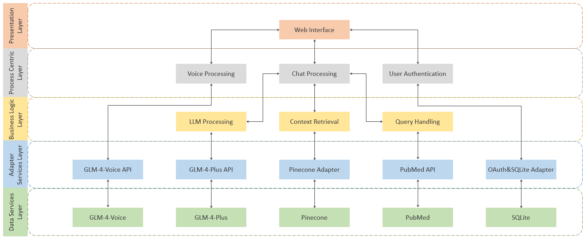

# LLM-Health-Assistant
---

<div align="center">
  
  <p><em>Logo</em></p>
</div>

<div align="center">
    <table>
        <tr>
            <td align="center">
                <a href="docs/LLM Health Assistant Project Report.pdf"><strong>A Brief Report</strong></a><br>
            </td>
            <td align="center">
                <a href="https://redocly.github.io/redoc/?url=https://raw.githubusercontent.com/Avalon-S/LLM-Health-Assistant/main/docs/openapi.json"><strong>API Document</strong></a><br>
            </td>
        </tr>
    </table>
</div>

---

## Disclaimer
The LLM Health Assistant provides general information only and does not constitute medical advice. It does not establish a doctor-patient relationship. Always consult a qualified healthcare professional for medical concerns. We are not responsible for any decisions made based on the platform’s information.

---

## Table of Contents

1. 📖[Introduction](#introduction)
2. 🏗️[Service Architecture](#service-architecture)
3. 🛠️[Technology Stack and Development Tools](#technology-stack-and-development-tools)
4. 🚀[Usage](#usage)
5. 🎥[Project Display](#project-display)
6. 🔍[Reflection and Future Enhancements ](#reflection-and-future-enhancements )
7. 📜[License](#license)

---

## [Introduction](#introduction)
 The LLM Health Assistant is a health consultation platform based on a **large language model (LLM)**, leveraging **generative AI** and **retrieval-augmented generation (RAG)** technologies to provide users with personalized and intelligent health Q&A services. The system integrates multiple functional modules, including **text interaction**, **voice interaction**, **PubMed paper retrieval**, **user information management**, and **conversation storage**.

[Back to Table of Contents](#table-of-contents)

---

## Service Architecture
The system follows a **4-Layer Architecture** (not include presentation layer) to ensure efficiency, scalability, and security:

1. Presentation Layer
   - Provides the user interface for interactions, supporting both text and voice input.
   - Sends user requests to the **Process Centric Layer** for processing.
   - Key Components:
     - **Web Frontend (HTML/CSS/JS)**: Login, health consultation, voice chat, user profile management.

2. Process Centric Layer
   - Coordinates the overall business logic and invokes various APIs for task execution.
   - Core functionalities:
     - **User Authentication** (OAuth2 + JWT)
     - **Text Chat Processing** (GLM-4-Plus)
     - **Voice Processing** (GLM-4-Voice)
     - **History Retrieval** (Pinecone)
     - **Medical Paper Search** (PubMed API)
   
3. Business Logic Layer
   - Handles AI interaction, context retrieval, and query parsing.
   - Core functionalities:
     - **LLM Processing** (GLM-4-Plus for intelligent responses)
     - **Context Retrieval** (Pinecone for historical conversation storage)
     - **Query Handling** (PubMed API for medical paper retrieval)
  
4. Adapter Services Layer
   - Manages interactions with external APIs and ensures system extensibility.
   - Key components:
     - **GLM-4-Plus API** (Processes text-based queries)
     - **GLM-4-Voice API** (Handles voice interactions)
     - **Pinecone Adapter** (Stores and retrieves user conversations)
     - **SQLite Adapter** (Manages user authentication and data)
     - **PubMed API** (Fetches the latest medical research)

5. Data Services Layer
- Provides foundational AI and database services that power the application.
- Key components:
  - **GLM-4-Voice** (Processes speech input and generates voice responses)
  - **GLM-4-Plus** (Handles text-based health queries and generates intelligent responses)
  - **Pinecone** (Stores and retrieves user conversation history for context-aware interactions)
  - **PubMed** (Provides medical research data for evidence-based health consultations)
  - **SQLite** (Manages user authentication and stores basic user information)

<div align="center">
  
  <p><em>System Architecture</em></p>
</div>

[Back to Table of Contents](#table-of-contents)

---

## Technology Stack and Development Tools
### Backend
- **FastAPI** (Lightweight web framework supporting high concurrency)
- **SQLite** (Lightweight database for user data storage)
- **Pinecone** (Vector database for user conversation history)
- **OAuth2.0 + JWT** (User authentication for API security)
- **PubMed API** (Medical literature retrieval)

### Frontend
- **HTML, CSS, JavaScript** (For the user interface)
- **Fetch API** (For frontend-backend communication)

### AI Models
- **GLM-4-Plus** (Text-based health consultation)
- **GLM-4-Voice** (Voice input processing)
- **Sentence Transformer (all-MiniLM-L6-v2)** (Text embedding for context retrieval and semantic search)

### Development Tools
1. **Hardware**
- **Operating System**: Windows 11 Home
- **CPU**:   Intel(R)  Core(TM) i7-14700HX @2.1GHZ
- **GPU**:   NVIDIA  GeForce RTX 4070 Laptop GPU (8 GB)
- **Memory**: 32 GB

2. **Software**

| Tool        | Purpose                             |
|------------|-------------------------------------|
| Anaconda   | Development environment management |
| VS Code    | Code development                   |
| JupyterLab | Early-stage experiment exploration |
| Edge Browser | Frontend interface testing       |
| Postman    | API testing                        |

[Back to Table of Contents](#table-of-contents)

---

## Usage
1. **Running Code**

```bash
git clone https://github.com/Avalon-S/LLM-Health-Assistant
cd LLM-Health-Assistant
```

Create a `.env` file in the project root and add the following API keys:
```env
# SECRET_KEY can be generated randomly by you.
SECRET_KEY=your_secret_key
ZHIPU_API_KEY=your_glm_api_key
PINECONE_API_KEY=your_pinecone_key
```

- Install Dependencies
```sh
pip install -r requirements.txt
```

- Run the FastAPI Server
```sh
uvicorn main:app --host 0.0.0.0 --port 8000 --reload
```

Once started, API documentation can be accessed via:
```bash
http://localhost:8000/redoc
```

- Run the Frontend
Input `http://localhost:8000/` in your browser to access the LLM Health Assistant web interface.

- Enter the administrator system
```bash
python Cli_DB_Manager.py
```
<div align="center">
  
  <p><em>Code Running</em></p>
</div>

2. **Build & Run the Docker Image**

Before doing this, make sure the Docker CLI is enabled. It is recommended to install Docker Desktop.

```bash
git clone https://github.com/Avalon-S/LLM-Health-Assistant
cd LLM-Health-Assistant
```

Create a `.env` file in the project root and add the following API keys:
```env
# SECRET_KEY can be generated randomly by you.
SECRET_KEY=your_secret_key
ZHIPU_API_KEY=your_glm_api_key
PINECONE_API_KEY=your_pinecone_key
```

- Build the image (without using cache), it takes about 10-20 minutes, depending on your internet speed.
```bash
docker-compose build --no-cache
```

- Start the container (run in the background)
```bash
docker-compose build --no-cache
```

- Stop all containers started by `docker-compose` up
```bash
docker-compose down
```

<div align="center">
  
  <p><em>Image Running</em></p>
</div>

[Back to Table of Contents](#table-of-contents)

---

## Project Display

<div align="center">
  
  <p><em>Login Page</em></p>
</div>

<div align="center">
  
  <p><em>Dashboard Page</em></p>
</div>

<div align="center">
  
  <p><em>Health Chat Page</em></p>
</div>

<div align="center">
  
  <p><em>Voice Chat Page</em></p>
</div>

[Back to Table of Contents](#table-of-contents)

---

## Reflection and Future Enhancements 

At the beginning, the initial plan was to [locally deploy LLaMA 3.2 1B and 3B](https://github.com/Avalon-S/LLaMA-Factory-SDE). However, during later development, there were numerous dependency conflicts, and the models performed extremely poorly in multi-turn conversations, with severe hallucinations. Moreover, locally deploying an LLM would result in an excessively large Docker image, making deployment time-consuming. Therefore, we switched to using GLM-4-Plus, which delivers performance comparable to GPT-4o, and the results have been satisfactory.

It should be noted that the strategy for deciding whether to call specific APIs to enhance the prompt in this project follows an **expert system** approach. Specifically, if certain keywords are detected, such as *my age* or *paper*, the system will automatically call the Pinecone or PubMed API, respectively, for retrieval. This is a simple, fast, and effective strategy. LangChain was not used because experiments showed that the task was not complex (no deep reasoning required), and using an agent to determine which API to call took significantly longer than letting the LLM respond directly. Additionally, there was no difference in answer quality—GLM-4-Plus was already powerful enough.

Overall, despite the tight timeline, I am fairly satisfied with the implementation of this project.

[Back to Table of Contents](#table-of-contents)

---

## License

This project is licensed under the MIT License. See the `LICENSE` file for details.

[Back to Table of Contents](#table-of-contents)

---